# Touch Gesture Authentication Research
An individual research project using touch gestures to enhance smartphone authentication with unsupervised machine learning. Touch Gesture Features such as users' tap pressure, x, y coordinates, keystrokes and reaction times were obtained to train a novelty detection algorithm. 
This research aims to investigate whether including the reaction time(RT) of users into the set of existing touch gesture features can increase the performance of touch gesture authentication.

## Application Architecture
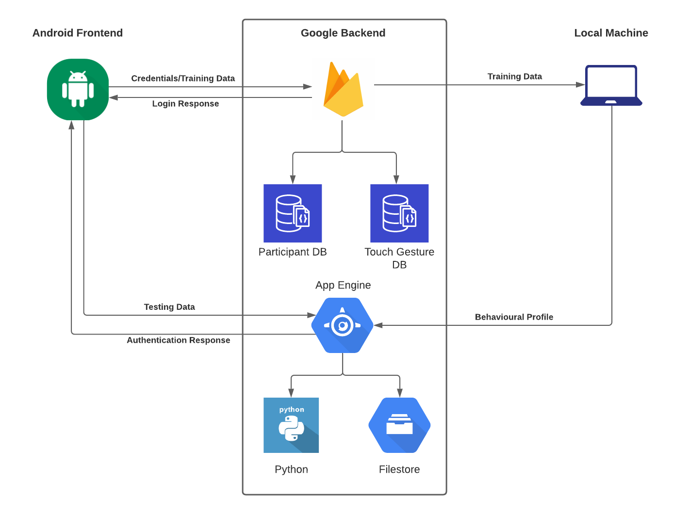 

## Data Collection
To achieve the research aims, two data collection UI were developed: One which captures existing touch gesture features (Keystroke UI) and the other that captures existing
touch gesture features with reaction time (Reaction Time UI)

Keystroke UI               |  Reaction UI
:-------------------------:|:-------------------------:
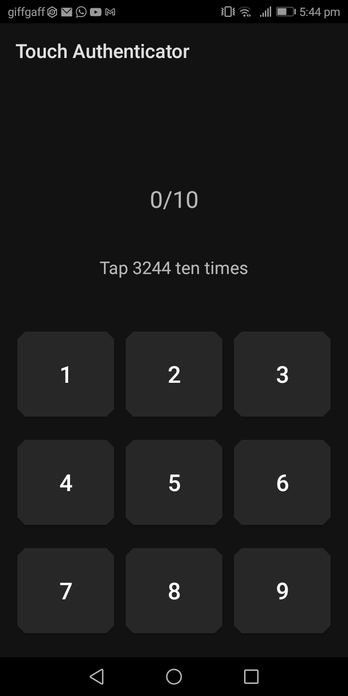 | 

Using the Keystroke UI, participants were required to tap the box that is currently
highlighted. Each time the highlighted
box was successfully tapped, another random box will be lit up. The raw
data obtained are the x and y coordinates, tap pressure, and timestamp of tap
events. In particular, the keyhold and intertap temporal features was used as
the metrics for reaction time. 

Using the Reaction Time UI, participants were required to tap “3224” for 10 times each day. The raw data obtained
is similar to the reaction time enrolment phase, with the difference that the intertap and keyhold features were not considered as the participant’s reaction time. Rather, it will be used as one of the features frequently used in
keystroke dynamics.

## Features
Keystroke                  |  Description
:-------------------------:|:-------------------------:
downX(n)                   |  X-coordinate of the screen during the initial nth tap
downY(n)                   |  Y-coordinate of the screen during the initial nth tap
downPressure(n)            |  Touch pressure during the initial nth tap
avgdownPressure            |  Average touch pressure across 4 taps
avgkeyhold                 |  Average keyhold duration across 4 taps
stdkeyhold                 |  Standard deviation of keyhold duration across 4 taps
avgintertap                |  Average intertap duration across 4 taps
stdintertap                |  Standard deviation of intertap duration across 4 taps

## Data Analysis and Hypothesis Formulation
To form an initial hypothesis on whether reaction time can improve touch
dynamics authentication, a high-level 3d scatter plot was made for both the
keystroke and reaction dataset to visualise how segregated each set of data
points (which belongs to a particular participant) are from the other set of
data points (which belong to other participants). The 3 features chosen were
avgPressure on the x-axis, avgKeyhold on the y-axis and avgIntertap on the
z-axis, and they were normalised as they had different range of values. avgPressure was chosen as it provides good segregation (Y. Meng, Wong, and
Kwok, 2014). The other two temporal features were selected to visualise the
impact of RT on the degree of data points segregation. The scatter plots can
be observed in Figure 4.7 and 4.8

Keystroke                                                                            |  Reaction Time
:-----------------------------------------------------------------------------------:|:-----------------------------------------------------------------------------------:
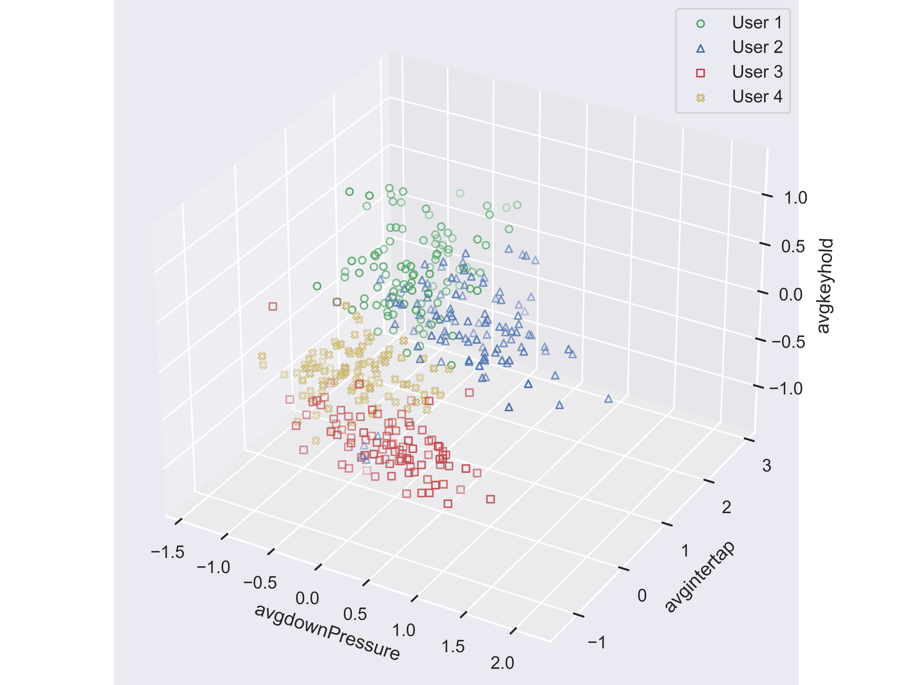 | 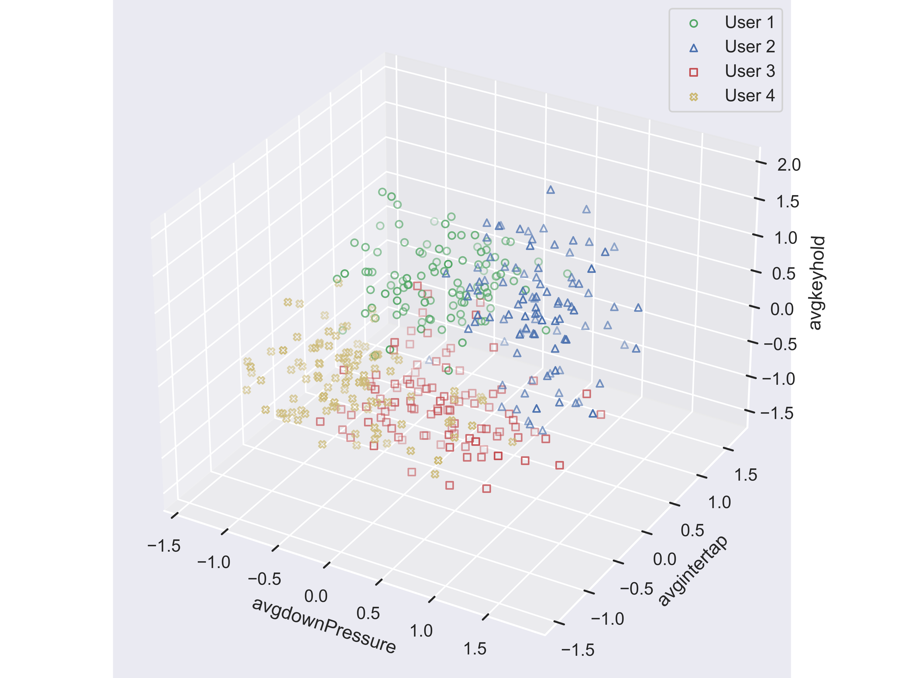

Looking at the scatter plots, it can be observed that both datasets displayed
some degree of segregation between the participants. However, each set of
data points within the keystroke dataset is closer to each other compared to
that of the reaction time dataset. Additionally, there is much more overlap
between sets of data point in the RT dataset. Likely, the reaction time of each
participant is not consistent and therefore, the data points within each cluster
have a higher variation. Based on this analysis, it is likely that the high intravariability of reaction time would result in poorer authentication performance
when compared with keystroke, touch gesture authentication.

## Model Fitting
The algorithm selected for building behavioural profiles were based on the
following considerations:
- No imposter data was available for each participant during enrolment.
- Training data for each participant is small.

For the first consideration, this is akin to a real-life scenario, whereby it is
highly unlikely that a user’s smartphone is frequently used by other people.
In this setting, one-class classification algorithms would be more suitable and
thus, the algorithms considered were all unary classifiers. For the second case
where the sample size is small, it is vital to select a model that is not too
complex to prevent overfitting. Based on these two conditions, a set of models were considered, which includes Local Outlier Factor and other statistical distance-based methods such as Euclidean Distance and Dynamic Time
Warping. However, due to time constraints, only one algorithm ([Local Outlier
Factor](https://scikit-learn.org/stable/modules/generated/sklearn.neighbors.LocalOutlierFactor.html)) was utilised to build the behavioural profile for each participant.

## Evaluation
Metrics for static biometric authentication include False Rejection Rate (FRR), False Acceptance Rate (FAR) and Equal Error
Rate (EER). FRR describes the ratio of the number of unsuccessful authentications for a legitimate user to the number of samples provided by the
legitimate user. On the other hand FAR measures the ratio of the number of successful authentications for imposters to the number of samples provided by the
imposters. For both FAR and FRR, the lower it is, the better the security performance
of the biometric system. However, this may be hard to achieve in practice, as
there is an inherent trade-off between those two metrics: The system can either
be very strict (lower FAR with higher FRR) or much more relaxed (higher
FAR with lower FRR). Essentially, a threshold value α can be adjusted
to control the strictness. Finally, EER is the value at which
FAR = FRR, which can be achieved by adjusting α. This metric can be used
to evaluate the biometric system as a whole. 

The following figures shows the plot of error (FMR or FNMR) against the
matching score (the value returned by the decision function of Scikit-Learn’s
implementation of LOF) for each participant. Essentially, the matching scores
within this figure serve as the threshold α; the more negative the matching
score, the less strict the biometric system is, and vice versa. The important
aspect of these graphs is the intersections of the two curves, which gives us
the Equal Error Rate. Based on these sub-figures, it can be observed that
the intersections of the curve for the keystroke dataset is lower than the RT
dataset, indicating that RT reduces authentication performance.

User | Keystroke                  |  Reaction Time 
:-------------------------:|:-------------------------:|:-------------------------:
1 | 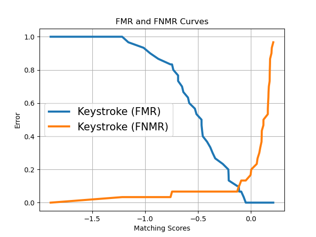 | 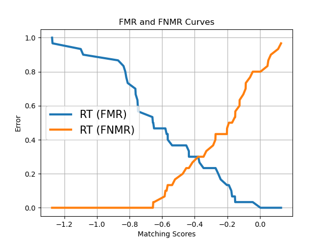 
2 | 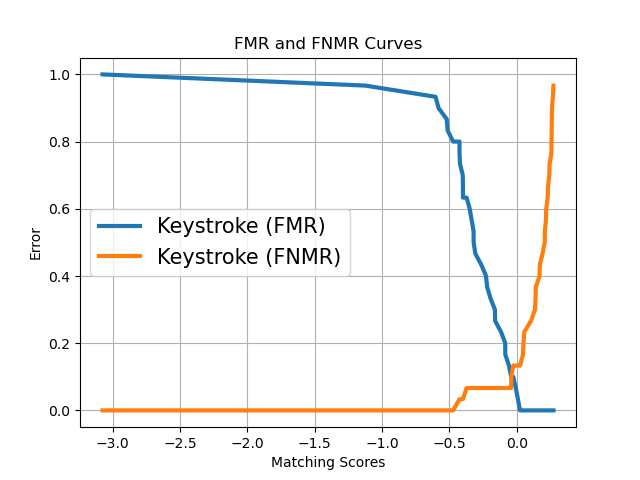 | 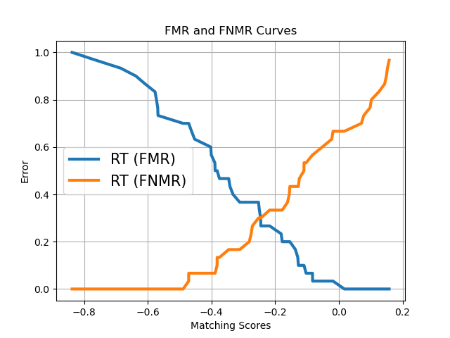 
3 | 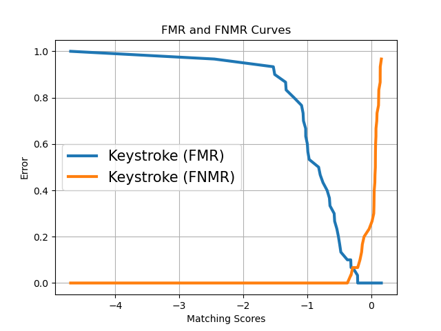 | 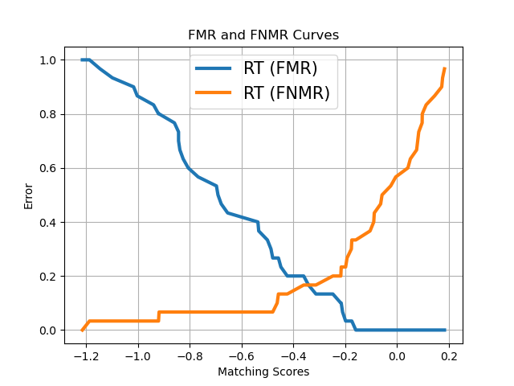 
4 | 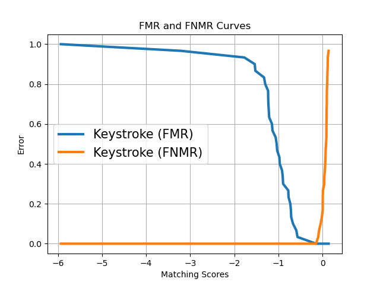 | 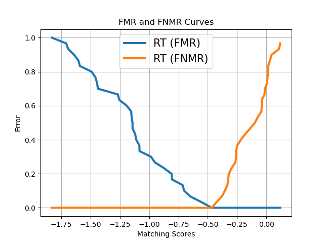 

## Conclusion
Evaluation was conducted by training two instances of
the Local Outlier Factor novelty detection algorithm, and the results showed
that the model trained on Reaction Time dataset had a higher average EER of 6.11%,
while the model trained on the keystroke dataset had a lower average EER of
4.19%. Based on the initial hypothesis and evaluation results, it is concluded
that RT does not improve the security performance of smartphone touch gesture authentication.

